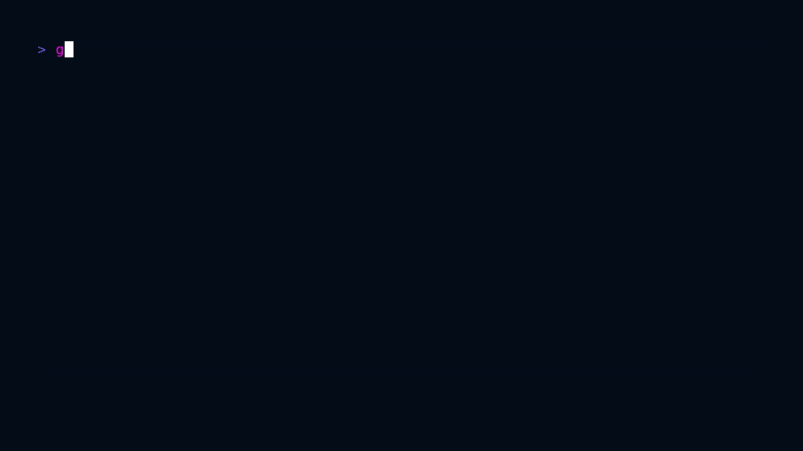
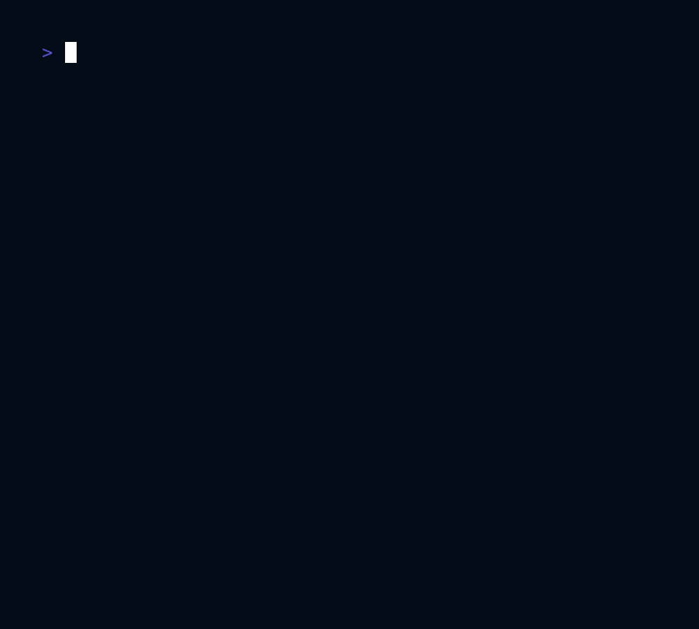

<h1 align="center"><code>LNZ</code></h1>
<h3 align="center"><i> Learning Zone </i></h2>

---

1. [W ?](#w-)
2. [Sources](#sources)
3. [Dira](#dira)

---

# W ?

> This will be all the learning related stuff for the main project will make a note thaat shiiz here

# Sources

| 🦓 |♒                                                                                              |
| :---------------------------------------------------------------------------------------------------------------------: | :------------------------------------------------------------------------------------------------------------------------------------------------------------------------------------------: |
| [Building a Cli Kanban Board with Bubble Tea](https://www.youtube.com/playlist?list=PLLLtqOZfy0pcFoSIeGXO-SOaP9qLqd_H6) |                                                                Using the bubble tea framework , babe whose piss must be sweet                                                                |
|         [Golang TUI Project Basics - Shopping List - Part I](https://youtu.be/5lxQJS3b38w?si=1JHGxlm1kITLhqYC)          | Will do this first and them move to the one above since they both are related , goal is to finish both of them 24 hours from writing this, trying to bury nose deep in her sweaty ass crack. |

> Basically that work will be here , later on to be incorporated into your main work
> Note this is just for the Kanban board , but the actual one which you will do will be after understanding how this was made

# Dira 

As usual this will be the dirs in dis ass

🥇 | 👚 | 👙
|:--:|:--:|:--:|
[`sl1`](./sl1/) | Shopping list version 1 | 
[`sl2`](./sl2/) | Shopping list version 2 | 
[`sl2test`](./sl2test) | Shopping list adding pusi header  | 
[`cbt`](./cbt/) | Bubble Tea Command Line demo| 
[`gla`](./gla/) | Glamour testing , which is render markdown in cli, note binary is huge about 16mb as such  |    Version 2 of Above 
[`lis1`](./lis1/) | Colorful List Testing, this one only prints messages to the screen |