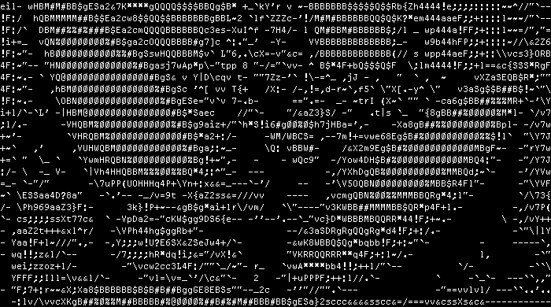

# GLA

Using [Glamor](https://github.com/charmbracelet/glamour) , render Markdown in a cli command 

1. Will be testing this out here

# Extract Image from GIF

```sh 
ffmpeg -i db.gif -ss 00:00:02 -vframes 2 j1.jpg j2.jpg
```
- This will extract 2 assandpussy 
- 