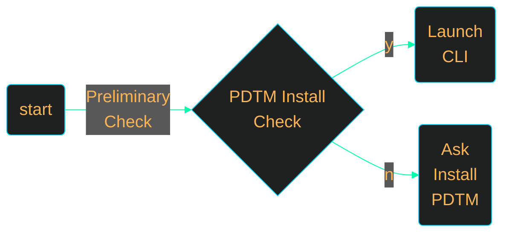
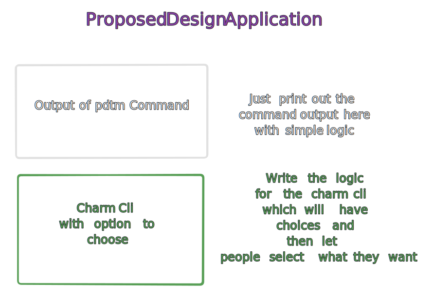

<h1><code> Project Plan Notes </code></h1>

----

1. [What ?](#what-)
2. [Project name](#project-name)
3. [Planis](#planis)
   1. [Flow](#flow)
      1. [Flow Components](#flow-components)
      2. [Components](#components)
      3. [Dev Notes](#dev-notes)
         1. [Regarding Output Types and deign](#regarding-output-types-and-deign)
4. [Dira](#dira)

----

# What ?

> This is going to be your notes and though process on making this shizzle , Once you get his right , then transfera in to the right place
> Need to go through atleast one charm tutoza to understand what thangs

# Project name

1. PDTM TUI

# Planis

> Planning for getting this started

## Flow

> This will be the expected flow of the project

🤣__Bastard mermaid no renderin in this fucking markdown bastard , will write above shit in words__

1. Check if PDTM installed
2. If not installed ask to install PDTM
3. If installed then only launch tui
   1. Better this way or after seeing tui will not be good
   2. Or you can do it the other way also for aesthetics reasons

### Flow Components

1. Program will have to have one codeblock that is reponsible for checking if PDTM is installed or not
2. Then the secondary GUI part
3. Run some tests with checking whats installed

### Components

1. PDTM Install Checker - This will check if its installed or not in the first place
2. Banner - Nice banner with pj logo and name of this shizz
3. TUI - Show status of the tool installation
   1. Just reading about this , you can do this by capturing output of PDTM and then have that displayed in the charm tui ?
   2. This all possible with go , you need to see if charm can do this stuff
      3. Testing this charm cli for this is priority
4. Enable installation with go get
   1. Test how to do this several times

### Dev Notes

#### Regarding Output Types and deign

1. You were trying to parse the output of the pdtm command , but that is complicated , and parsing the output iself might not be a good idea since that can change and you would have to rewrite that , instead follow this design

- This is the easiest way of doingthis instead of any parsing pussy
- Afte writin this the plan now is the learn the charm cli to understand what can and cannot be done , do the 5 part course to understand this 

# Dira

> Directory structure as usual

🥇 | 🤪
|:--:|:--:|
[`co`](./co/) | Various Component testing
[`spt`](./spt/) | Go Spinner Testing  Here wanted to do testing of spinners and arrived at a conclusion to use waitgroups and mutexes to ensure that multiple spinners are going to run

